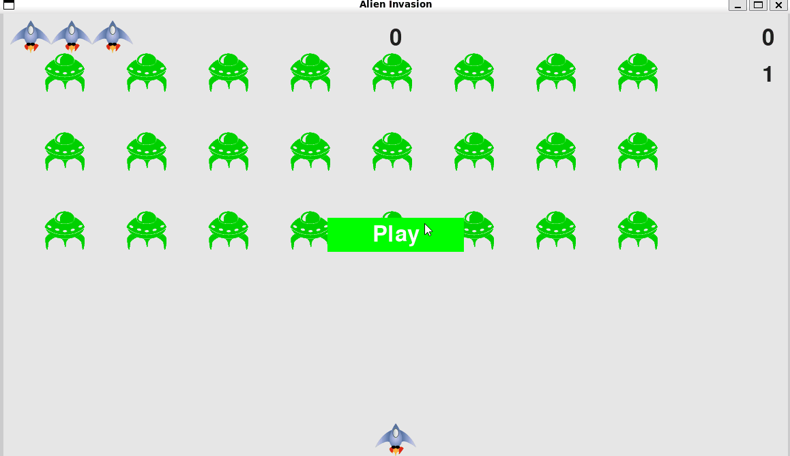

# Alien Invasion


This project is a classic arcade style game. Each level increases in difficulty, there are 3 lives per game, and the top score of the session is recorded and displayed. Built using Python using Pygame to practice and implement OOP, game loop and event handling.

## Features
### Gameplay
- Control a spaceship at the bottom of the screen.
- Move left and right using arrow keys.
- Shoot bullets (using spacebar) to destroy of aliens.
- Aliens move horizontally and descend gradually toward the player.
- The game ends if an alien reaches the bottom or collides with the spaceship.

### Scoring & Progress
- Score increases for each alien destroyed.
- Multiple levels with increasing alien speed and difficulty.
- Optional high-score tracking.

### Graphics & Sound
- Simple but engaging 2D graphics.

### User Interface
- Start screen with **Play** button.
- Game over screen showing final score.
- Optional pause functionality.

## Requirements
- Python 3.10+
- See `requirements.txt`

## How to Run (Manual Setup)
```bash
git clone https://github.com/davidsaridakis/alien_invasion
cd alien_invasion
python -m venv venv
source venv/bin/activate  # or venv\Scripts\activate on Windows
pip install -r requirements.txt
python alien_invasion.py
```
## Quick Start

### Mac / Linux / WSL
```bash
./run.sh
```
### Windows
- Double-click `run.bat`
- Or run from a terminal:
```cmd
run.bat
```


